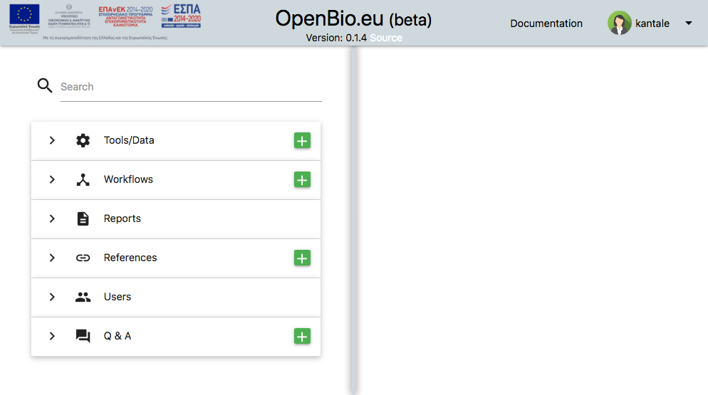

# Introduction
This is an incomplete documentation of the platform.

[OpenBio.eu](https://www.openbio.eu) is an environment for open and collaborative science. 
On OpenBio you can search, create, store, use, share and comment Tools and Workflows that take part in open scientific experiments. 
This is the documentation of OpenBio but it is written like a tutorial. Maybe in the future we will offer both in two separate documents.  
Most of this tutorial and examples assume that you have created an account and that you have verified your email.

So let's take things from the beginning...

This is the home page of the OpenBio.eu platform:


The screen is divided in two parts. The left part is a search panel for various objects. The right panel displays these objects and is also a space for editing and.. experimentation.

Let's start with the first item on the left panel which is Tools/Data.

## Tools/Data
Click the green '+' button on the Tools/Data row of the left panel to create a new Tool or a new Dataset. 
Something like this will show up:


Before we move on to create our new Tool or Dataset you need to know a few things about the platform:

### **OpenBio.eu is able to "run" objects.**
There are many repositories that store tools, data and workflows. 
Examples are [bio.tools](https://bio.tools/), [osf.io](https://osf.io/) and [omictools](https://omictools.com/).
These repositories offer very rich description and annotation of these objects, but they lack one crucial abilitiy: to actually run this object (i.e. tool, workflow) on a computer that you have access to.
OpenBio.eu is a repository of research objects that focus on this ability.
Therefore, when you add or edit a new tool, data or workflow you need to provide explicit instruction of how to install the tool, download the data or execute the workflow. 

### **OpenBio.eu's language for object installation/download/execution description is Bash**
Since you need to provide explicit instructions of how to install a tool, download data or execute a workflow, we need a computer language to do so.
We chose [Bash](https://www.gnu.org/software/bash/).  
Most people will think "why Bash and not a general purpose, easy language like python?". Here are our thoughts on that:


Set a name of your tool (or dataset) and a version.
Available characters are ```a-z```, ```A-Z```, ```0-9``` and ```_``` for both fiels.


Tools and Data are indistinguishable in the platform. 


## Workflows 
A workflow should contain one (and only one) "main" step. When the Workflow gets executed this is the step that gets called. All other steps should (directly or in-directly) get called from this step. This is similar to the "main" function in C/C++/Java.

### Nodes
* Octagon: a Workflow
* Green Circle: Step
* Green Circle with RED Border: A main step
* Green Circle with BLACK Border: A step that it is main in a sub-workflow 
* Round Rectangle: A tool
* Round Rectangle with green border: An input node
* Round Rectangle with red border: An output node

## API
```bash
curl -H 'Accept: application/json; indent=4'  http://0.0.0.0:8200/platform/rest/tools/
```

