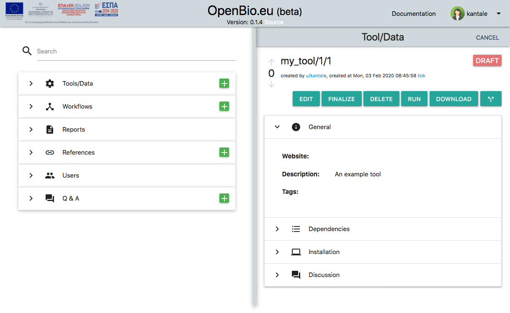
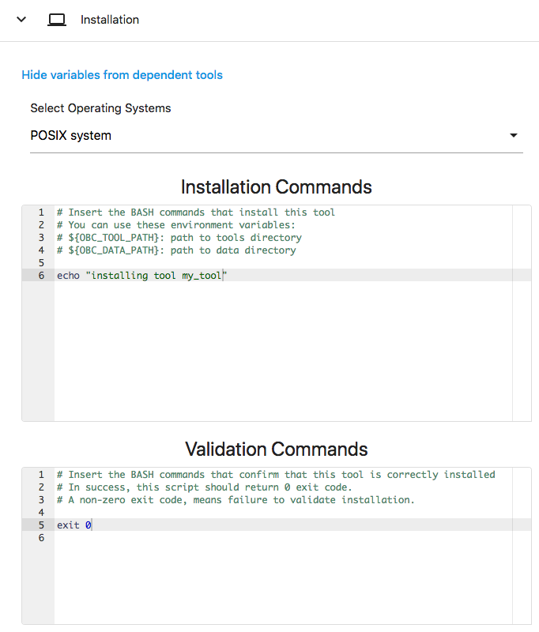
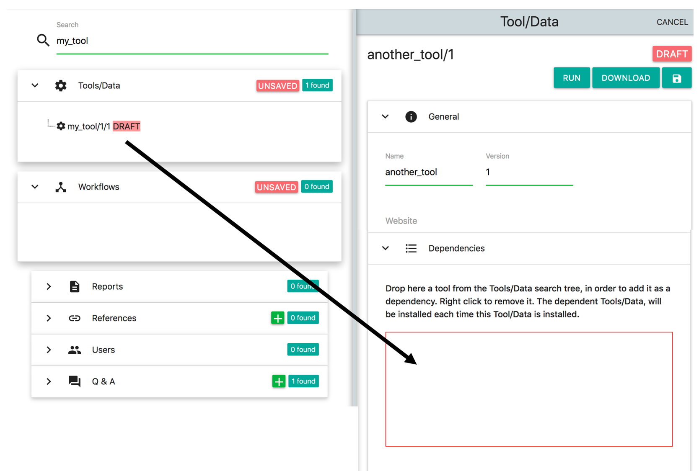
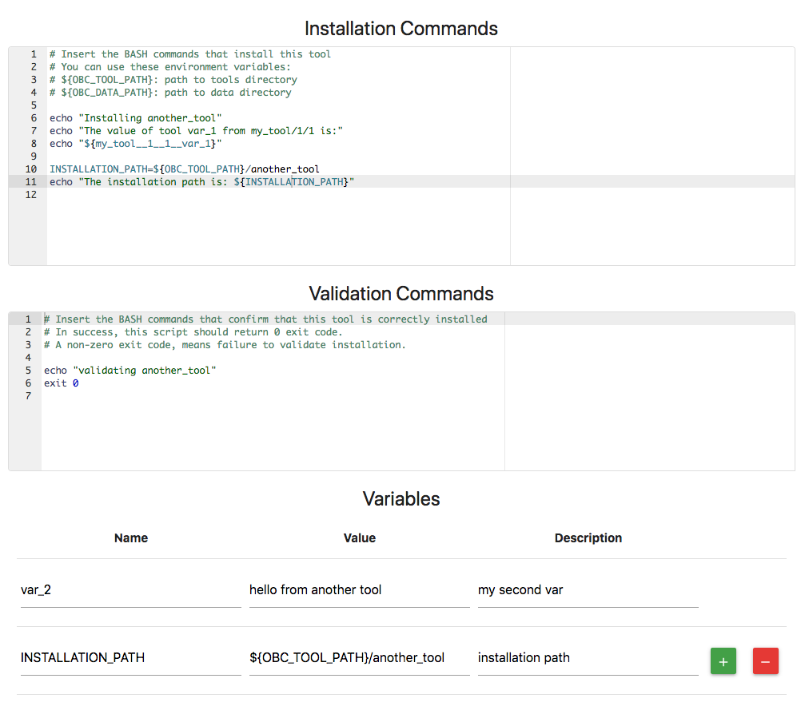
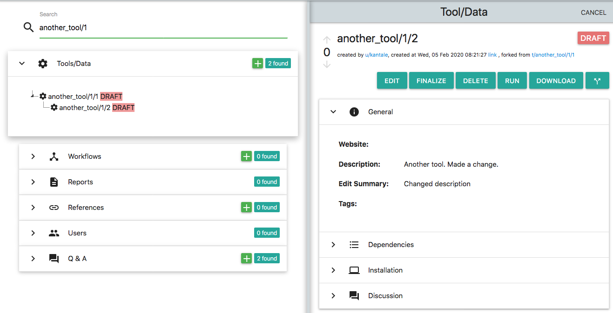
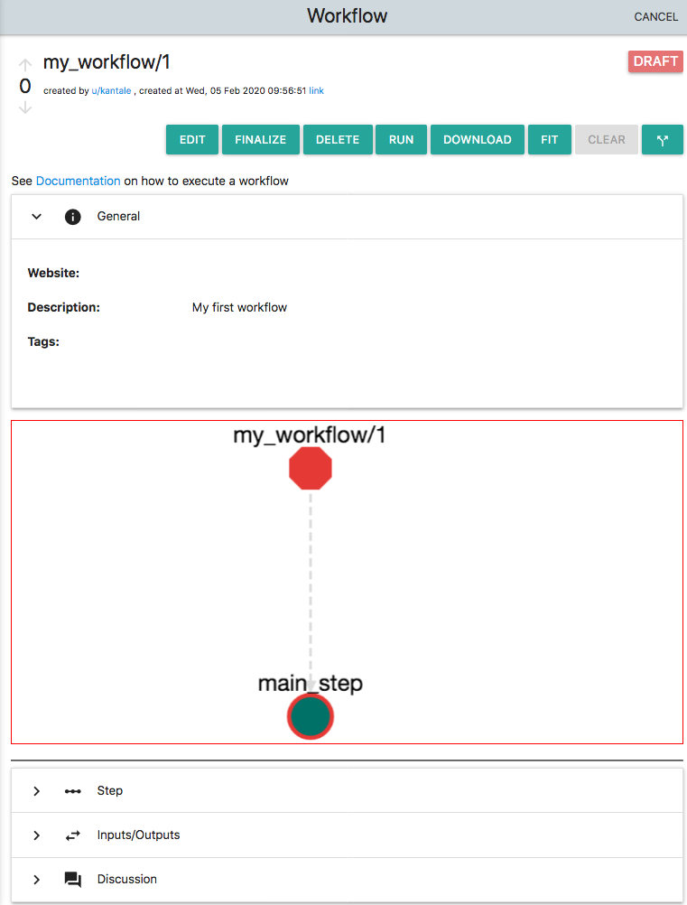
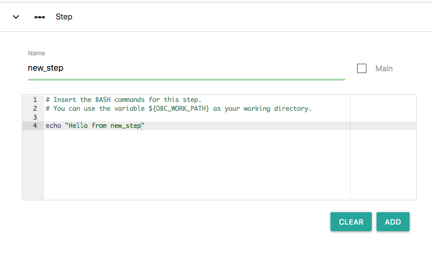
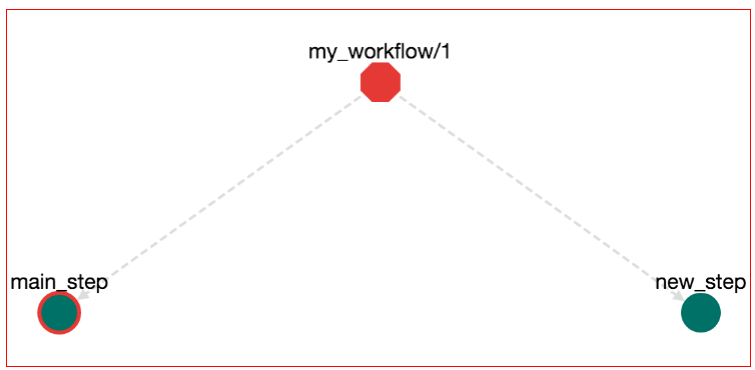
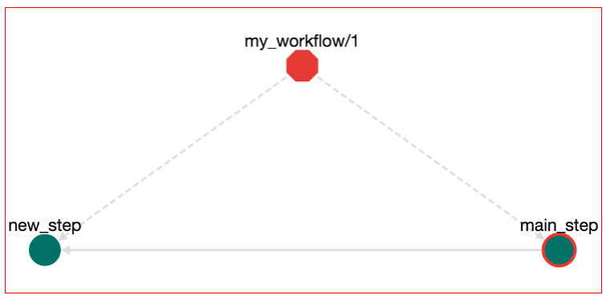

# Introduction
This is an incomplete documentation of the platform.

[OpenBio.eu](https://www.openbio.eu) is an environment for open and collaborative science. On OpenBio you can search, create, store, use, share and comment Tools and Workflows that take part in open scientific experiments. This is the documentation of OpenBio but it is written like a tutorial. Maybe in the future we will offer both in two separate documents.  Most of this tutorial and examples assume that you have created an account and that you have verified your email.

## Before we start

Before we move on to create our new Tool or Dataset you need to know a few crucial things about the platform. What makes openbio.eu different from other platforms?

1. **OpenBio.eu is able to "run" objects.**
There are many repositories that store tools, data and workflows.  Examples are [bio.tools](https://bio.tools/), [osf.io](https://osf.io/) and [omictools](https://omictools.com/). These repositories offer very rich description and annotation of these objects, but they lack one crucial abilitiy: to actually run this object (i.e. tool, workflow) on a computer that you have access to. OpenBio.eu is a repository of research objects that focus on this ability.Therefore, when you add or edit a new tool, data or workflow you need to provide explicit instruction of how to install the tool, download the data or execute the workflow. 

2. **OpenBio.eu's language for object installation/download/execution description is Bash.**
Since you need to provide explicit instructions of how to install a tool, download data or execute a workflow, we need a computer language to do so. We chose [Bash](https://www.gnu.org/software/bash/). Some people will find Bash, difficult or outdated. Nevertheless Bash is the defacto glue language of the [\*nix universe](https://en.wikipedia.org/wiki/Unix-like). Bash is present by default in OSx and even [Windows 10 supports it natively](https://docs.microsoft.com/en-us/windows/wsl/install-win10). By hosting our code in Bash we make sure that it is directly executable in as many as possible environments. 

   Also: **Hosting code in Bash does not mean that other languages are excluded**. 
   On the contrary, Bash was chosen because it is easy to link together different languages, programs, other scripts and logic in a common script.

3. **In OpenBio.eu Tools and Data are the same type of objects.**
Most Workflow Management Systems and Open Science environments distinguish Tools from Data. Users have to declare different properties for each, store them in different tables etc. OpenBio.eu does not make this distinction. Tool and Data are exactly the same type of objects, this is why on the remaining of this text, we will refer to these as "Tools/Data".

   But why is that? Semantically and in the context of a Workflow Management System, Tools and Data do not actually have any differences! Tools have dependencies but data are useless without the presence of other data. We need commands to download, configure, compile and install tools but data need to be downloaded and most of the times they also need to be decompressed, pre-processed and installed. Also it is very common tools and data to co-exist in a dependency tree of other tools and data. 

## Outlook of OpenBio.eu
First of all OpenBio.eu is a [Single-page application](https://en.wikipedia.org/wiki/Single-page_application). You might have already noticed this. Interacting with openbio.eu does not change the links shown in your browser. So techically there isn't any "front page". When entering OpenBio.eu what you see is:


The screen is divided in two parts. The left part is a search panel for various objects. The right panel displays these objects and is also a space for editing and.. experimentation.

Let's start with the first item on the left panel which is Tools/Data.

## Tools/Data
Click the green '+' button on the Tools/Data row of the left panel to create a new Tool/Data. 
Something like this will show up:


Set a name of your tool (or dataset) and a version. Available characters are ```a-z```, ```A-Z```, ```0-9``` and ```_``` for both fields. For the purpose of this tutorial let's assume that you entered ``my_tool`` as name and "1" as version.  

Other fields are:
* Website (Optional). This needs to be a valid URL.
* Description (Obligatory). You can use markdown and you can also preview your edits. For the purpose of this tutorial let's assume you entered "```An example tool```".
* Keywords (Optional)

Now save the tool/data by pressing the disc icon. Your tool/data is now saved. This is what you will see:



Let's focus on the ```my_tool/1/1``` part (the last digit might be different in your case). What is this?

Each Tool/Data has a unique ID in openbio.eu. This unique ID is comprised by three parts:
* The name that you have declared.
* The version that you have declared. 
* A number provided by the system, called "edit". This number is derived so that the Name/Version/Edit of this tool/data is unique. 

**In OpenBio.eu we refer to a unique tool with the following schema: ```<Name>/<Version>/<Edit>```. For example: ```my_tool/1/1```. This can be interpreted as "tool named my_tool version 1, edit 1".**

Here is the philosophy behind this naming/ID-ing scheme. In a repository of scientific objects, we want to store Tools/Data. Tools and Data have names and they also have versions (for Data they might also be called "releases"). An example is [Samtools version 1.8](https://github.com/samtools/samtools/releases/tag/1.8) and [1000 Genomes Project data release 20130502](ftp://ftp.1000genomes.ebi.ac.uk/vol1/ftp/release/20130502/). In most scientific Tool/Data repositories these have a unique string based ID. For example could be called "Samtools" or "1000 Genomes Project", but that wouldn't identify precisely the research object at least not for reproducubility standards. Versions need to be part of the names. Then we face another problem which is that OpenBio.eu is a crowdsourced environment where you can name your Tool/Data however you like. This means that under the name/version Samtools/1.9 you can include Bash commands that download 1000 Genomes Project data (or anything else..). The solution here is to let anyone choose whatever name/version they like, but add on the ID of the Tool/Data a number (edit) that is provided by the system. That way we can have Samtools/1.8/1 created from user A and Samtools/1.8/2 created from user B. These two can be two completely unrelated Tool/Data objects. We should also let other users show preferences on which Tool/Data is better. This is possible with updvotes and downvotes that we describe later.


### Downloading a Tool/Data 
On the "Download" dropdown, select "BASH executable". A file named ```bash.sh``` get's downloaded. As you might have guessed you can actually execute this file. If you don't know how, there are many online resources to help you on that (just google: run .sh file). Before executing it, you should read carefully the following:

**Always execute scripts that you have downloaded from openbio.eu (or from anywhere on the Internet..) in a [sandboxed environment](https://en.wikipedia.org/wiki/Sandbox_%28computer_security%29). If you don't know what that is then DO NOT RUN IT! OpenBio.eu takes absolutely no liability on damages caused by executing scripts downloaded from openbio.eu.**

Now, assuming that you moved the downloaded script in a sandboxed environment, one way to run it is with:
```bash
bash bash.sh
```

The output is:
```
OBC: Workflow name: root
OBC: Workflow edit: 0
OBC: Workflow report: None
OBC: INSTALLING TOOL: my_tool/1/1
OBC: INSTALLATION OF TOOL: my_tool/1/1 . COMPLETED
OBC: VALIDATING THE INSTALLATION OF THE TOOL: my_tool/1/1
OBC: VALIDATION FOR TOOL: my_tool/1/1 FAILED
OBC: CALLING STEP: step__main__root__None    CALLER: main
OBC: Output Variables:
```

Let's break this down. When you download a tool a new Workflow is created (we will see more on Workflows, later). Workflows have a name and an edit (similar to Tools/Data having a name a version and an edit). Since here you downloaded a Tool/Data and not a Workflow, a dummy workflow is created that has the name "root" and edit 0. Also the execution of a Workflow creates a "Report" (more on this later as well..). The interesting part is:

```
OBC: INSTALLING TOOL: my_tool/1/1
OBC: INSTALLATION OF TOOL: my_tool/1/1 . COMPLETED
```

```OBC```  stands for "OpenBio-C" which is the name of the project. Everything that is printed that is OpenBio.eu specific, has the "OBC" suffix so that you can filter this out easily. Initially the script tries to Install the tool by running the "Installation commands" of the tool. The line ```OBC: INSTALLATION OF TOOL: my_tool/1/1 . COMPLETED``` tell us, that the execution of the "Installation commands" has finished. Then it moves to the the execution of the "Validation commands":

```
OBC: VALIDATING THE INSTALLATION OF THE TOOL: my_tool/1/1
OBC: VALIDATION FOR TOOL: my_tool/1/1 FAILED
```

Here we notice that the "Validation commands" have failed! Why is that?

Let's move back to the platform. On the left part of the platform, on the search input, we can search for ```my_tool```. The one created by you appears:


On the items that appear, click the one that you created before (i.e. my_tool/1/1). Now on the right panel unfold the "Installation" commands. There you will notice two Bash editors, the one titled "Installation Commands" and the other is called "Validation Commands":


**Installation Commands** are Bash commands that install this tool/data. For example here you can include commands that download, compile and install a tool or download, decompress and pre-process a dataset.

**Validation Commands** are Bash commands that validate that this tool/data has been installed correctly. For example here you can add commands that check if the tool can be executed with some simple input or check if the data has the expected [checksum](https://en.wikipedia.org/wiki/Checksum). 

Here we notice that initially ```Installation Commands``` are empty whereas ```Validation Commands``` contain an ```exit 1```. The exit code of the ```Installation Commands``` is not checked. The exit code of the ```Validation Commands``` is checked. On your scripts you should add logic on the ```Validation Commands``` so that if the installation of a tool/data cannot be validated, then an ```exit 1``` (or exit with any non-zero number) should be executed. 

As it is right now, the ```Installation Commands``` and the ```Validation Commands``` cannot be edited. To do so click on the ```EDIT``` button on the top of the page. Upon pressing "EDIT" you will notice that many elements on the page became editable. One of these is the ```Installation Commands``` and the ```Validation Commands```. Change the ```Installation Commands``` so that it includes the command:

```bash
echo "installing tool my_tool"
```

And change the ```Validation Commands``` so that it will always exits 0 (this is actually a bad practice, always do some actual checks before exiting with 0).

```bash
exit 0
```

The environment should look like this:



Now press "SAVE" again, then Download the "BASH executable" as before and run the ```bash.sh``` again in a sandboxed environment. Now you will notice that the validation status has changed to ```SUCCEEDED```:

```
OBC: Workflow name: root
OBC: Workflow edit: 0
OBC: Workflow report: None
OBC: INSTALLING TOOL: my_tool/1/1
installing tool my_tool
OBC: INSTALLATION OF TOOL: my_tool/1/1 . COMPLETED
OBC: VALIDATING THE INSTALLATION OF THE TOOL: my_tool/1/1
OBC: VALIDATION FOR TOOL: my_tool/1/1 SUCCEEDED
OBC: CALLING STEP: step__main__root__None    CALLER: main
Output Variables:
```

Also notice the output of the "Istallation Commands": ```installing tool my_tool```. 

So far we have shown that OpenBio.eu is a repository of "downloadable" Tool/Data where each one has Installation and Validation commands in Bash language. The next part is to demonstrate the use of tool/data variables.

### Tool/Data Variables 
When you have installed a Tool/Data you need to let other scripts know where these tools/data are. Apart from the installation path of the Tool/Data there might be other pieces of information that you want to share with other tools/data or with other workflows. This piece of information can be stored in the Tool/Data Variables section. Each Tool/Data variable has a name, a value and a description. 

Let's edit again the my_tool Tool/Data. Click the "EDIT" button, unfold the "Installation" panel and go to the bottom of this panel. There, add a variable with the name: ```var_1``` , value ```hello world``` and description: ```my first variable```. Click SAVE. This is what it should look like:


Now download again the BASH Executable, and run it. The output should be:

```
Workflow name: root
Workflow edit: 0
Workflow report: None
OBC: INSTALLING TOOL: my_tool/1/1
installing tool my_tool
OBC: INSTALLATION OF TOOL: my_tool/1/1 . COMPLETED
OBC: VALIDATING THE INSTALLATION OF THE TOOL: my_tool/1/1
OBC: VALIDATION FOR TOOL: my_tool/1/1 SUCCEEDED
OBC: SET my_tool__1__1__var_1="hello world"   <-- my first variable 
OBC: CALLING STEP: step__main__root__None    CALLER: main
Output Variables:
```

Notice that after validating the tool, it sets the variable named ```my_tool__1__1__var_1``` the value ```hello world```. The name of the variable (```my_tool__1__1__var_1```) can be interpreted as "variable named var_1 of the tool my_tool with version 1 and edit 1".

### Tool/Data dependencies 
Suppose that the we have another tool/data which depends from my_tool. Let's call this tool/data 'another_tool' and assume version 1. Since in OpenBio.eu we *have to* insert the installation / validation Bash commands, we also *have to* declare the depencencies of this tool/data. Click the '+' button on Tools/Data and add ```another_tool``` as name and ```1``` as version. Also unfold the 'Dependencies panel'

Next, enter ```my_tool``` on the search text field on the left and locate the item on the results that you created before. Now drag and drop this item in the Dependencies panel (red border):

  

This is how you declare Tool/Data dependencies in OpenBio.eu. It is important to note that during the installation of Tool/Data ```another_tool```, the ```my_tool``` will be installed first. Also the variables of ```my_tool``` are accessible in the Installation and Validation Commands of ```another_tool```. To use them, simply select them from the tree that appears above the Bash editors and drop them in the Bash editors:


Ta see what has happened we can add some dummy Installation and Validation Commands and we can also add a variable in ```another_tool```. For example add the following in the Installation commands:

```bash
echo "Installing another_tool"
echo "The value of tool var_1 from my_tool/1/1 is:"
echo "${my_tool__1__1__var_1}
```

And the following in the Validation Commands:
```bash
echo "validating another_tool"
exit 0
```

We can also add a variable named ```var_2```. Now the data on ```another_tool``` should look like this: 


Now if we save, Download the "Bash Executable", and run it we will see something like this:

```
OBC: Workflow name: root
OBC: Workflow edit: 0
OBC: Workflow report: None
OBC: INSTALLING TOOL: my_tool/1/1
installing tool my_tool
OBC: INSTALLATION OF TOOL: my_tool/1/1 . COMPLETED
OBC: VALIDATING THE INSTALLATION OF THE TOOL: my_tool/1/1
OBC: VALIDATION FOR TOOL: my_tool/1/1 SUCCEEDED
OBC: SET my_tool__1__1__var_1="hello world"   <-- my first variable 
OBC: INSTALLING TOOL: another_tool/1/1
Installing another_tool
The value of tool var_1 from my_tool/1/1 is:
hello world
OBC: INSTALLATION OF TOOL: another_tool/1/1 . COMPLETED
OBC: VALIDATING THE INSTALLATION OF THE TOOL: another_tool/1/1
validating another_tool
OBC: VALIDATION FOR TOOL: another_tool/1/1 SUCCEEDED
OBC: SET another_tool__1__1__var_2="hello from another tool"   <-- my second var 
OBC: CALLING STEP: step__main__root__None    CALLER: main
OBC: Output Variables:
```

Here we notice a few things:
* ```my_tool``` was installed and validated before ```another_tool```. This is because ```my_tool``` is a dependency to ```another_tool```.
* During the installation of ```another_tool```, the value of the variable var_1 from my_tool/1/1 is printed. Generally, all tool/data variables, are accessible from any tool/data that is installed after them. 

### The ${OBC_TOOL_PATH} and ${OBC_DATA_PATH} variables 
On your installation scripts, you are encouraged to use the ```${OBC_TOOL_PATH}``` variable as the root path of all the installed tools of OpenBio.eu. For example when you want to download a file, decompress an archive or install a tool you are encouraged to do this in a directoty that lies under ```${OBC_TOOL_PATH}```. For example you can do:

```bash
MY_TOOL_PATH=${OBC_TOOL_PATH}/my_tool
mkdir ${MY_PATH}
wget -O ${MY_TOOL_PATH}/tool.tgz http://www.example.com/tool.tgz
```

By confirming to this, you can let other users define the desired location they want to install the OpenBio.eu tools. They can do this by simply exporting the variable ${OBC_TOOL_PATH} on bash. Similarly you are encouraged to use the variable ${OBC_DATA_PATH} to define the location of the data downloaded from Bash scripts in OpenBio.eu. These variables can be used as values in the Tool/Data variables. For Example:



Notice the value of variable ```INSTALLATION_PATH``` that includes the ```${OBC_TOOL_PATH}``` variable. Now we can define the value of ${OBC_TOOL_PATH} and then run the bash.sh script. The output is (some lines were removed for brevity):
```
#> export OBC_TOOL_PATH=/my/precious/location
#> bash bash.sh 
The installation path is: /my/precious/location/another_tool
OBC: SET another_tool__1__1__var_2="hello from another tool"   <-- my second var 
OBC: SET another_tool__1__1__INSTALLATION_PATH="/my/precious/location/another_tool"   <-- installation path 
```

### Finalizing and Forking tool/data
You may have noticed that so far you can save and edit a Tool/Data as many times as you want. Of course only the creator of a Tool/Data is allowed to edit it. This functionality has two side effects:

* Allowing to make changes to a Tool/Data, strips out the "reproducibility" of these objects. What if an experiment is based on a Data and the creator decides to change the installation instructions? This might affect the reproducibility of the experiment. 
* Allowing only the creator to edit a Tool/Data strips out the crowdsourcing ability. What if a user wants to make an edit to the tool/data of another user?

To battle these issues, we employ two mechanisms. The first is the "Finalizing". By Finalizing a Tool/Data you permanently "freeze" this object from changes. You cannot edit a Tool/Data that has been finalized. Also Tool/Data that have not been finalized are labelled as **DRAFT**. It is a good practice to Finalize your Tool/Data after thorough testing. DRAFT Tool/Data should not be used in "serious" analysis since computational reproducibility is not guaranteed. The philosophy behind the "Finalizing" mechanism is to test and experiment with DRAFT tools/data, but once these object are ready to be used as independent components in public scientific pipelines, then they should be finalized.  

The second mechanism is "forking". By forking a Tool/Data you can create an indentical Tool/Data object that is owned by you. Every forked Tool/Data is by default in a "draft" stage. Both Draft and Finalized Tools/Data can be forked. Let's see how it looks. Select the tool named ```another_tool``` that you created before. You can do that by entering ```another_tool/1``` in the search box on the left panel. From all the items that appear under the Tools/Data section, select the one created by you (or anything else that you like and you want to fork..). Once you click this item, a card with the details of this Tool/Data appears on the right. Now click the "Fork" button which is the rightmost button on the top of this card. Now the card becomes editable and you can make whatever changes you like. On this card there is an "Edit Summary" field that is obligatory. Here you should briefly describe the changes that you made from the original object. Once you complete with these changes you can save the new object. This is what it looks like:



There are a few things to notice here:
* On the left side of the platform, where the search results appear, you can see that there is a new Tool/Data object named ```another_tool/1/2```. This object is "under" the ```another_tool/1/1```. **Search results appear as a tree of objects. Parent-Child nodes mean that Childs where forked from Parenst**.
* The platform assigned a new "edit" number to the newly created Tool/Data. Remember that each Tool/Data has a unique ID which is comprised by three parts. A "name", a "version" and an "edit". Although the user sets the "name" and the "version", the "edit" is assigned by the platform. The new object that was created by forking ```another_tool/1/1``` has the same name and the same version, but different edit. This is also shown on the top of the right panel which states "forked from t/another_tool/1/1". Again the edit numbers might be different in your case.

### Deleting a Tool/Data 
Deleting Tool/Data is possible if:
* You own (have created) this Tool/Data.
* The Tool/Dats is in Draft stage
* There isn't any Tool/Data that uses this Tool as a dependency.
* There isn't any workflow that uses this Tool.

The deletion is permanent from the database and there is no action to restore it. 

## Workflows
[Scientific Workflow Management Systems (SWMS)](https://en.wikipedia.org/wiki/Scientific_workflow_system) have been around for many decades. [This awesome list](https://github.com/pditommaso/awesome-pipeline) contains hundreds of frameworks, libraries, platforms, languages, etc for managing and organizing tools and data into pipelines. OpenBio.eu is not exactly "Yet another SWMS". The purpose of OpenBio.eu is not to teach you "the correct language", or "data model" or "abstraction" in order to create scientific pipelines. The purpose is to help you create, publish and share your pipeline in whatever language / model / SWMS you like. There is only one prerequisite. The pipeline should be able to be expressed somehow in Bash. For example if your pipeline is a python script that runs with:

```bash
python my_awesome_pipeline.py --input input_file --output output_file
```

This is good enough for OpenBio.eu since this is valid Bash. But if the pipeline requires a GUI (Graphical User Interface), then chances are that OpenBio.eu is not for you. 

Now let's start. On the left part of the platform click the green "+" button on "Workflows" section. This is what you will see:


Add a name to the workflow i.e. ```my_workflow``` and also add a description  (i.e. "my first workflow"). These two fields are obligatory. On the description you can use markdown. By default a new Workflow in OpenBio contains a single "step" which is called "main_step". On the workflow graph click the node "main_step". The Step editor below unfolds. Now you can edit this step. Enter: ```echo "Hello from my_workflow"``` and click "UPDATE". Save this new workflow by clicking on the "Save" icon which is the rightmost on the top of this card. With the Workflow saved the platform should look like this:



The most important part here is that the name of the workflow appears as ```my_workflow/1```. This is because a unique ID of a workflow is comprised by two parts:
* A "name" provided by the user
* A number called "edit" provided from the platform.

The naming/ID-ing scheme is exactly the same as with Tools/Data. The only difference is that Workflows do not have versions. The idea here is that Tools/Data are items that get "fetched" (i.e. downloaded) from the Internet. They have versions that are maintained externally (outside OpenBio.eu), hence the "version" is part of the identity of a Tool/Data. On the other hand, Workflows are sets of Tool/Data, plus the logic that combines them for the purpose of an analysis. Workflow are merely constructs that exist only in OpenBio.eu this is why they don't have "version". Nevertheless they do have an edit, so it is possible to have multiple Workflows with the same name. 

Now, let's download and run this workflow. Select "BASH Executable" from the "Downlood" dropdown. A file named "bash.sh" gets donloaded. Run this as before (i.e. with ```bash bash.sh```). The output should be:

```
OBC: Workflow name: my_workflow
OBC: Workflow edit: 1
OBC: Workflow report: None
OBC: CALLING STEP: step__main_step__my_workflow__1    CALLER: main
Hello from my_workflow
OBC: Output Variables:
```

Notice that unlike before, when we run a Tool/Data object, it shows the Workflow name and Workflow edit. The "report" part will be explained later. Let's break the line: ```OBC: CALLING STEP: step__main_step__my_workflow__1    CALLER: main```:
* OBC: Stands for OpenBio-C (the name of the project). 
* ```step__main_step__my_workflow__1``` Means that we are executing the step called "main_step" that belongs to the workflow ```my_workflow/1```. 
* ```CALLER: main``` means that this step is the "main" step, and it is not called from another step.

The output ```Hello from my_workflow``` is the output from the command ```echo "Hello from my_workflow"``` that you entered in the main_step earlier. 

Let's add a new step at the Workflow. First click the "EDIT" button on the ```my_workflow/1``` workflow. Click in the "Step" section, add the name "new_step" and add the following Bash commands:

```bash
echo "Hello from new_step"
```

This is what it should look like:



Now press the "ADD" button. A new node has been added on the workflow that represents the new step:



Although we have added a new step, we haven't declared how to call it. Let's alter the workflow so that the step ```main_step``` calls the step ```new_step```. Click on the ```main_step``` node. The Bash editor for the ```main_step``` opens. Then you can change the Bash commands from:

```bash
echo "Hello from my_workflow"
```

to:

```bash
echo "Hello from my_workflow"
step__new_step__root__null
```

But what does the ```step__new_step__root__null``` mean? This actually means "call the step ```new_step``` that belongs to the root workflow". We will see later that workflows can contain other workflows. Also workflows have steps. A step in a workflow can have the same name with another step in another workflow. Therefore when you call a step you need to declare to which workflow this step belongs. Also ```root_null``` is the name of the main workflow, or else the workflow that is being edited right now. Now press the "UPDATE" button to update the ```main_step```. The workflow has been changed and an edge from step ```main_step``` to step ```new_step``` has been added:



Now we can save these edits (press the save button on top-right), download the workflow (press Download-->Bash Executable) and run the file that gets downloaded (with ```bash bash.sh```). The output is:

```
OBC: Workflow name: my_workflow
OBC: Workflow edit: 1
OBC: Workflow report: None
OBC: CALLING STEP: step__main_step__my_workflow__1    CALLER: main
Hello from my_workflow
OBC: CALLING STEP: step__new_step__my_workflow__1    CALLER: main_step__my_workflow__1
Hello from new_step
OBC: Output Variables:
```

Notice that the first step called is the ```main_step``` that prints ```Hello from my_workflow```. Then this step calls ```new_step``` that prints ```Hello from new_step```. Now it is time to discuss on one of the main features of OpenBio.eu and how this feature differentiates OpenBio.eu from other Workflow Management Systems:

**In OpenBio.eu steps are called from other steps. Or else in OpenBio.eu you do not define step order, instead you define step logic.**

Suppose that we want to add the tool [plink](http://zzz.bwh.harvard.edu/plink/) in the platform. If you are not familiar with plink or with what plink does, do not worry! What you need to know is that plink is one of the millions open source 


## Workflows 
A workflow should contain one (and only one) "main" step. When the Workflow gets executed this is the step that gets called. All other steps should (directly or in-directly) get called from this step. This is similar to the "main" function in C/C++/Java.

### Nodes
* Octagon: a Workflow
* Green Circle: Step
* Green Circle with RED Border: A main step
* Green Circle with BLACK Border: A step that it is main in a sub-workflow 
* Round Rectangle: A tool
* Round Rectangle with green border: An input node
* Round Rectangle with red border: An output node

## API
```bash
curl -H 'Accept: application/json; indent=4'  http://0.0.0.0:8200/platform/rest/tools/
```

